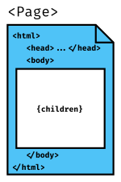

Write HTML documents with custom tags and render them with your React components.

Renderdoc is a static document generator. It takes an input HTML document with custom tags. You provide the React components that implement the tags. The output file is the rendered HTML.

## Example

As input, you need two things: an input HTML file, and a directory that contains some React components.

```
my-document.html
components/
    Chapter.js
    Header.js
    Page.js
```

Here is your input file: `my-document.html`

```html
<Header>My Life Story</Header>
<Chapter title="The Beginning">
  It was a dark and stormy night.
</Chapter>
```

In the `components` directory, you have these React components:

```js
// components/Chapter.js
import React from 'react';
export default function Chapter({ title, children }) {
  return (
    <div className="Chapter">
      <h2>{title}</h2>
      {children}
    </div>
  );
}
```

```js
// components/Header.js
import React from 'react';
export default function Header({ children }) {
  return <h1 className="Header">{children}</h1>;
}

```

```js
// components/Page.js
import React from 'react';
export default function Page({ children }) {
  return (
    <html>
      <head>
        <meta charSet="utf-8" />
      </head>
      <body>{children}</body>
    </html>
  );
}
```

Run renderdoc on the source file. The `components` directory will be automatically used to load the components.

```shell
$ renderdoc my-document.html
```

The rendered output file:

```html
<!doctype html>
<html>
  <head>
    <meta charSet="utf-8" />
  </head>
  <body>
    <h1 class="Header">My Life Story</h1>
    <div class="Chapter">
      <h2>The Beginning</h2>
      It was a dark and stormy night.
    </div>
  </body>
</html>
```

## Caveats

- The HTML input must be well-formed XML. Every tag must be closed or self-closing.
- The tags are case sensitive (that's because they're loaded by filename from the `components` directory)
- You need to supply a parent component to act as a wrapper. To render a HTML page, you probably want a component that renders a `<html>` element with the children wrapped in a `<body>`
- The final output will be prepended with `<!doctype html>` unless you disable this feature.

# Tutorial: Getting Started with Renderdoc

This tutorial will show you how to build a simple website with Renderdoc.

Renderdoc has simple defaults. Here are the default directories and what they're for:

* Put HTML pages into the `pages` directory. They can be nested in sub-directories.
* Put assets in the `public` directory and they will be copied to the build directory as-in. Use this for stylesheets, images, and other static files.
* Put React components into the `components` directory. They will be loaded automatically and used to render custom tags in your pages.
* The `build` directory is where Renderdoc will generate the output. You can serve the `build` directory with a static server.

Next, you need a layout component. Renderdoc uses this component to wrap each page. The layout component's responsibility is typically to render the `<html>`, `<head>` and `<body>` tags that are standard for any HTML page, wrapping the page content.



By default, Renderdoc looks for a layout component called `Page` at `components/Page.js`. You can specify a different layout component for all pages or specific ones.
